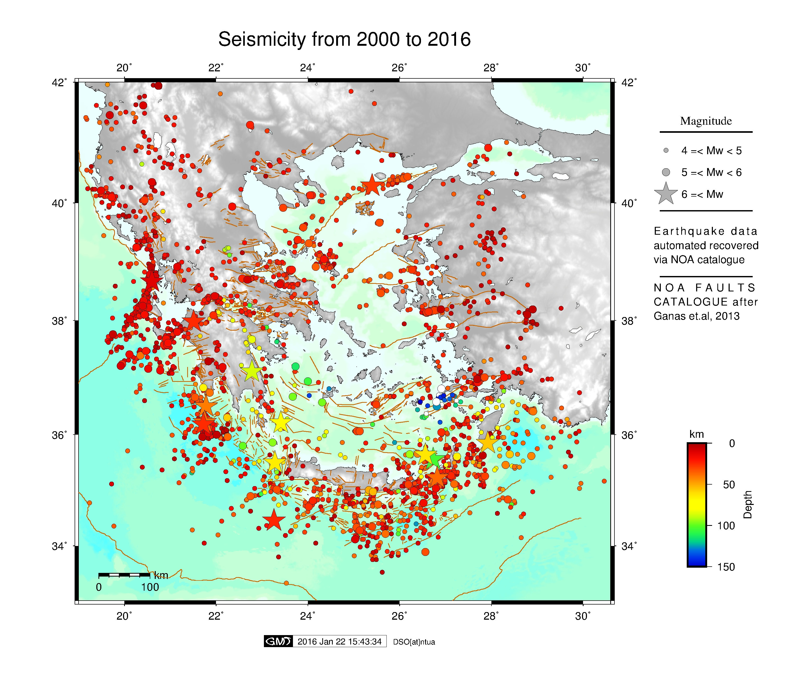

# Introduction
=======

This repository includes bash scripts that use [Generic Tool Maps (Wessel et al., 2013)](http://gmt.soest.hawaii.edu/projects/gmt) to plot National Observatory of Athens [NOA](http://www.noa.gr/index.php?lang=en) earthquake catalogue and historical earthquakes of Papazachos and Papazachou catalogue for the region of Greece. Also you can plot earthquake profiles ...


----------
**main scripts**

 1. plot_eq.sh : plots earthquakes
 2. plot_eq_proj.sh : plots earthquakes and profiles

**helpful files**

 3. default-param : default parameters for paths, input files and region configuration
 4. get_catalogue.sh : this script will download the [NOA earthquake catalogue](http://www.gein.noa.gr/services/full_catalogue.php)  and [fault database (Ganas et al., 2013)](http://www.gein.noa.gr/services/GPSData/1_NOAFaults/)

# Documentation
============
----------

 - Be sure that gmt is installed on your computer
 - Configure file *default-param*.

If you'd like to use topography, you can download world DEM from [here](https://www.ngdc.noaa.gov/mgg/global/global.html)
 
```
# //////////////////
# Set PATHS parameters
pth2dems=${HOME}/Map_project/dems
inputTopoL=${pth2dems}/ETOPO1_Bed_g_gmt4.grd
inputTopoB=${pth2dems}/ETOPO1_Bed_g_gmt4.grd
pth2logos=$HOME/Map_project/logos
pth2faults=$HOME/Map_project/faults/NOAFaults_v1.0.gmt

#///////////////////
# Set default REGION for GREECE
west=19
east=30.6
south=33
north=42
projscale=6000000
frame=2
```
For main scripts help function run:
```
  $> ./plot_eq.sh -h 
  ## (or)
  $> ./plot_eq_proj.sh -h
``` 
**plot_eq.sh**

**MAIN OPTIONS**

 Usage   : plot_eq.sh -r west east south north | -topo | -o [output] | -jpg

 - r      [:= region] region to plot west east south north (default Greece) use: -r west east south north projscale frame
 - mt     [:= map title] title map default none use quotes
 - updcat [:= update earthquake catalogue] 
 - topo   [:= topography] use DEM topography
 - faults [:= faults] plot NOA fault database
 - histeq [:= historic eq ] plot historical eq via papazachos catalogue
 
**EARTHQUAKE OPTIONS**
 - minmw  [:= minimum magnitude]  bug use only int
 - maxmw  [:= maximum magnitude]  bug use only int
 - starty [:= start year] 
 - stopy  [:= stop year] 
 
**OTHER OPRTIONS**
 - o    [:= output] name of output files
 - l    [:=labels] plot labels
 - leg  [:=legend] insert legends
 - logo [:=logo] plot logo
 - jpg : convert eps file to jpg
 - h    [:= help] help menu
 

 Exit Status:    1 -> help message or error
 Exit Status: >= 0 -> sucesseful exit

## Example:
```
$ ./plot_eq.sh -topo -faults -jpg -leg
```



----------
----------
**plot_eq_proj.sh**
In these script added an optio to plot rofile of earthquakes

  -eqproj [:=projection] plot projectio along profile
  ```    use -eqproj lon lat Az Lmin Lmax Wmin Wmax depth```
  
lon: start longitude of profile

lat: start latitude of profile

Az: Azimuth of profile

Lmin, Lmax: Profile Length start-stop

Wmin, Wmax: Profile width on the two sides of profile
depth: depth of profile

# Updates
========
- 21-1-2015: online version is available

# References
=========
Ganas Athanassios, Oikonomou Athanassia I., and Tsimi Christina, 2013. NOAFAULTS: a digital database for active faults in Greece. Bulletin of the Geological Society of Greece, vol. XLVII and Proceedings of the 13th International Congress, Chania, Sept. 2013.

Wessel, P., W. H. F. Smith, R. Scharroo, J. F. Luis, and F. Wobbe, Generic Mapping Tools: Improved version released, EOS Trans. AGU, 94, 409-410, 2013.

# Contact
=========
Demitris Anastasiou, danast@mail.ntua.gr

Xanthos Papanikolaou, xanthos@mail.ntua.gr


